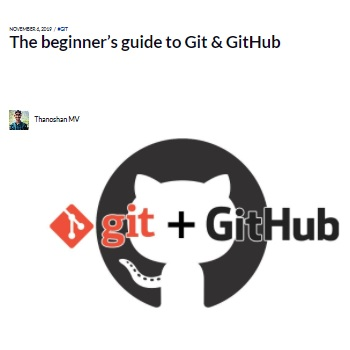
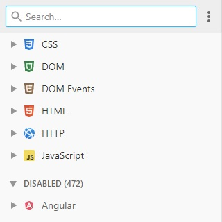

## CAD Learning Resources

### Introduction

The following resources are intended as a supplement to your course materials for the MSSA curriculum.

Some sections may not have resources listed yet - if you'd like to add yours, see the "Contributing" section at the bottom of the page!

### Fundamentals for Developers

Primarily geared toward future students preparing for their cohort, as well as current students who would like to take a step back and learn some fundamentals to enhance your understanding of the course content.

#### CAD Learning Path Prerequisites

<table>
    <tr>
        <td class="resource-image-cell">
            
        </td>
        <td>
            <a href="https://docs.microsoft.com/en-us/learn/certifications/exams/98-361" target="_blank">
                <h5 class="resource-title">MTA 98-361 - Software Development Fundamentals</h5>
            </a>
            

                Official information about the MTA exam on the Microsoft Docs website.
            

        </td>
    </tr>
    <tr>
        <td class="resource-image-cell">
            
        </td>
        <td>
            <a href="https://www.wiley.com/en-us/Exam+98+361+MTA+Software+Development+Fundamentals-p-9780470889114" target="_blank">
                <h5 class="resource-title">MTA 98-361 - Wiley Study Guide</h5>
            </a>
            

                This book is extremely popular among students preparing to take the MTA.
            

        </td>
    </tr>
        <tr>
        <td class="resource-image-cell">
            
        </td>
        <td>
            <a href="https://channel9.msdn.com/Series/software-development-fundamentals" target="_blank">
                <h5 class="resource-title">MTA 98-361 - Channel9 Series</h5>
            </a>
            

                An introductory-level MVA course that introduces fundamental software development concepts.
            

        </td>
    </tr>
</table>

#### Git and Source Control

<table>
    <tr>
        <td class="resource-image-cell">
            
        </td>
        <td>
            <a href="https://docs.github.com/en" target="_blank">
                <h5 class="resource-title">GitHub Docs</h5>
            </a>
            

                Documentation on GitHub and related topics.
            

        </td>
    </tr>
    <tr>
        <td class="resource-image-cell">
            
        </td>
        <td>
            <a href="https://learngitbranching.js.org/" target="_blank">
                <h5 class="resource-title">Interactive Git Branching Tutorial</h5>
            </a>
            

                A fun and interactive Git tutorial that starts with the basics.
            

        </td>
    </tr>
    <tr>
        <td class="resource-image-cell">
            
        </td>
        <td>
            <a href="https://www.freecodecamp.org/news/the-beginners-guide-to-git-github/" target="_blank">
                <h5 class="resource-title">Beginner's Guide to Git & GitHub</h5>
            </a>
            

                Quick-start guide on FreeCodeCamp.
            

        </td>
    </tr>
    <tr>
        <td class="resource-image-cell">
            
        </td>
        <td>
            <a href="https://git-scm.com/doc" target="_blank">
                <h5 class="resource-title">Official Git Documentation</h5>
            </a>
            

                Official documentation on git-scm.com.
            

        </td>
    </tr>
    <tr>
        <td class="resource-image-cell">
            
        </td>
        <td>
            <a href="https://try.github.io/" target="_blank">
                <h5 class="resource-title">Resources to Learn Git</h5>
            </a>
            

                More resources for learning Git, including sections such as "learn by reading", "learn by doing", and "GitHub training".
            

        </td>
    </tr>
</table>

#### Computer Science and Programming Fundamentals

<table>
    <tr>
        <td class="resource-image-cell">
            
        </td>
        <td>
            <a href="https://www.youtube.com/watch?v=kS_gr2_-ws8" target="_blank">
                <h5 class="resource-title">YouTube - Complete Beginner's Guide to Big O Notation (22m)</h5>
            </a>
            

                A complete overview of Big O Notation by Colt Steele on YouTube.
            

        </td>
    </tr>
    <tr>
        <td class="resource-image-cell">
            
        </td>
        <td>
            <a href="https://www.youtube.com/watch?v=kS_gr2_-ws8" target="_blank">
                <h5 class="resource-title">Big O CheatSheet</h5>
            </a>
            

                Visual representation of Big O complexity, and time complexity cheatsheets for various data structures and algorithms.
            

        </td>
    </tr>
</table>

### MSSA Curriculum

Current students might find the links in this section helpful as supplemental explanations for some of the topics your track covers.  Future students can also browse this section as a preview for what you'll be learning in class.

#### SQL

Coming soon!

#### C# and .NET

Coming soon!

#### ASP.NET Core MVC

<table>
    <tr>
        <td class="resource-image-cell">
            
        </td>
        <td>
            <a href="https://docs.microsoft.com/en-us/aspnet/core/mvc/overview?view=aspnetcore-3.1" target="_blank">
                <h5 class="resource-title">Microsoft Docs - Overview of ASP.NET Core MVC</h5>
            </a>
            

                Page on Microsoft Docs that explains the MVC pattern and how it works.
            

        </td>
    </tr>
    <tr>
        <td class="resource-image-cell">
            
        </td>
        <td>
            <a href="https://www.matthewdresser.com/asp.net-mvc/anti-patterns" target="_blank">
                <h5 class="resource-title">Anti-Patterns in ASP.NET MVC</h5>
            </a>
            

                From Matthew Dresser's blog, an article that can help you avoid some of the pitfalls that undermine the MVC pattern.
            

        </td>
    </tr>
</table>

#### Azure for Developers

Coming soon!

### Additional Topics

Targeted toward students who understand the baseline curriculum and have extra time left over after completing coursework, this section branches out into more advanced concepts for broadening your skill set and might help you identify specific areas of interest.

#### Coding Best Practices and Design Patterns

<table>
    <tr>
        <td class="resource-image-cell">
            
        </td>
        <td>
            <h5 class="resource-title">Wikipedia - Software Design Patterns and Underlying Concepts</h5>
            

                Some useful Wikipedia articles:
                <ul>
                    <li><a href="https://en.wikipedia.org/wiki/Software_design_pattern">Software Design Patterns</a></li>
                    <li><a href="https://en.wikipedia.org/wiki/Don%27t_repeat_yourself">Don't Repeat Yourself (DRY)</a></li>
                    <li><a href="https://en.wikipedia.org/wiki/Single_responsibility_principle">Single Responsibility Principle (SRP)</a></li>
                    <li><a href="https://en.wikipedia.org/wiki/Separation_of_concerns">Separation of Concerns</a></li>
                    <li><a href="https://en.wikipedia.org/wiki/SOLID">SOLID (Good Programming Practices)</a></li>
                </ul>
            

        </td>
    </tr>
    <tr>
        <td class="resource-image-cell">
            
        </td>
        <td>
            <a href="https://sahandsaba.com/nine-anti-patterns-every-programmer-should-be-aware-of-with-examples.html" target="_blank">
                <h5 class="resource-title">9 Anti-Patterns Every Programmer Should Be Aware Of</h5>
            </a>
            

                Describes common anti-patterns and the cognitive biases associated with them.
            

        </td>
    </tr>
</table>

#### Cloud Architecture Patterns

Coming soon!

### Developer Reference

<table>
    <tr>
        <td class="resource-image-cell">
            </td>
        <td>
            <h4 class="resource-title">DevDocs API Documentation</h4>
            

                A collection of documentation on many different technologies.
            

        </td>
    </tr>
</table>

### Contributing

This site is designed with MSSA students in mind, and aims to make contributions easy even for those who have minimal coding experience.  Students and mentors alike are all welcome to submit pull requests.

Take a look at the [Guide to Contributing](https://mssablog.github.io/contributing.html) page for ideas on how you can help and instructions for getting started!
