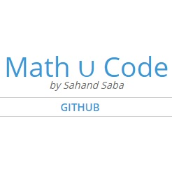

## CAD Advanced Topics

### Introduction

TODO: Introduction

### Coding Best Practices and Design Patterns

    

        
        <h5 class="resource-title">Wikipedia - Software Design Patterns and Underlying Concepts</h5>
        

Some useful Wikipedia articles:

            <a href="https://en.wikipedia.org/wiki/Software_design_pattern">Software Design Patterns</a> 
            <a href="https://en.wikipedia.org/wiki/Don%27t_repeat_yourself">Don't Repeat Yourself (DRY)</a> 
            <a href="https://en.wikipedia.org/wiki/Single_responsibility_principle">Single Responsibility Principle (SRP)</a> 
            <a href="https://en.wikipedia.org/wiki/Separation_of_concerns">Separation of Concerns</a> 
            <a href="https://en.wikipedia.org/wiki/SOLID">SOLID (Good Programming Practices)</a>
    

    

        
        <h5 class="resource-title">9 Anti-Patterns Every Programmer Should Be Aware Of</h5>
        

            Describes common anti-patterns and the cognitive biases associated with them.
        

    

### Cloud Architecture Patterns

Coming Soon!

### Contributing

This site is designed with MSSA students in mind, and aims to make contributions easy even for those who have minimal coding experience.  Students and mentors alike are all welcome to submit pull requests.

Take a look at the [Guide to Contributing](/contributing.html) page for ideas on how you can help and instructions for getting started!