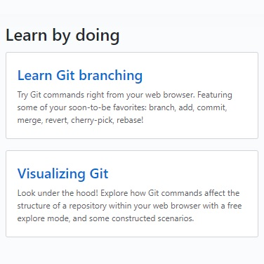
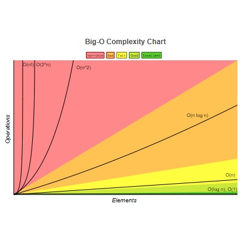

## Fundamentals for Developers

### Introduction

TODO: Introduction

### CAD Learning Path Prerequisites

    

        
        <h5 class="resource-title">MTA 98-361 - Software Development Fundamentals</h5>
        

            Official information about the MTA exam on the Microsoft Docs website.
        

    

    

        
        <h5 class="resource-title">MTA 98-361 - Wiley Study Guide</h5>
        

            This book is extremely popular among students preparing to take the MTA.
        

    

    

        
        <h5 class="resource-title">MTA 98-361 - Channel9 Series</h5>
        

            An introductory-level MVA course that introduces fundamental software development concepts.
        

    

### Git and Source Control

    

        
        <h5 class="resource-title">GitHub Docs</h5>
        

            Documentation on GitHub and related topics.
        

    

    

        
        <h5 class="resource-title">Interactive Git Branching Tutorial</h5>
        

            A fun and interactive Git tutorial that starts with the basics.
        

    

    

        
        <h5 class="resource-title">Beginner's Guide to Git & GitHub</h5>
        

            Quick-start guide on FreeCodeCamp.
        

    

    

        
        <h5 class="resource-title">Official Git Documentation</h5>
        

            Official documentation on git-scm.com.
        

    

    

        
        <h5 class="resource-title">Resources to Learn Git</h5>
        

            More resources for learning Git, including sections such as "learn by reading", "learn by doing", and "GitHub training".
        

    

### Computer Science and Programming Fundamentals

    

        
        <h5 class="resource-title">YouTube - Complete Beginner's Guide to Big O Notation (22m)</h5>
        

            A complete overview of Big O Notation by Colt Steele on YouTube.
        

    

    

        
        <h5 class="resource-title">Big O CheatSheet</h5>
        

            Visual representation of Big O complexity, and time complexity cheatsheets for various data structures and algorithms.
        

    

### Contributing

This site is designed with MSSA students in mind, and aims to make contributions easy even for those who have minimal coding experience.  Students and mentors alike are all welcome to submit pull requests.

Take a look at the [Guide to Contributing](/contributing.html) page for ideas on how you can help and instructions for getting started!