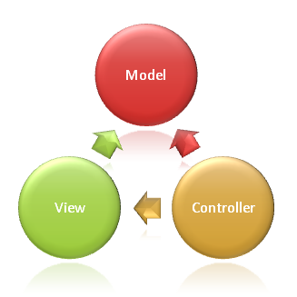
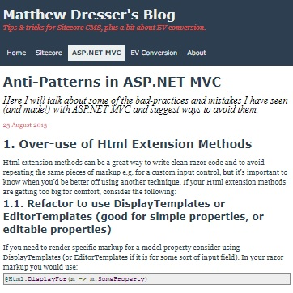

## CAD MSSA Curriculum

### Introduction

TODO: Introduction

### SQL

Coming soon!

### C# and .NET

Coming soon!

### ASP.NET Core MVC

    

        
        <h5 class="resource-title">Microsoft Docs - Overview of ASP.NET Core MVC</h5>
        

            Page on Microsoft Docs that explains the MVC pattern and how it works.
        

    

    

        
        <h5 class="resource-title">Anti-Patterns in ASP.NET MVC</h5>
        

            From Matthew Dresser's blog, an article that can help you avoid some of the pitfalls that undermine the MVC pattern.
        

    

### Azure for Developers

Coming Soon!

### Contributing

