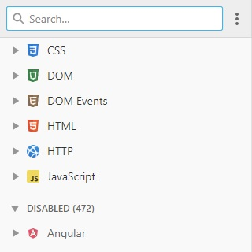

## Developer Reference

### Introduction

TODO: Introduction

### Links

    

        
        <h5 class="resource-title">DevDocs API Documentation</h5>
        

            A collection of documentation on many different technologies.
        

    

### Contributing

